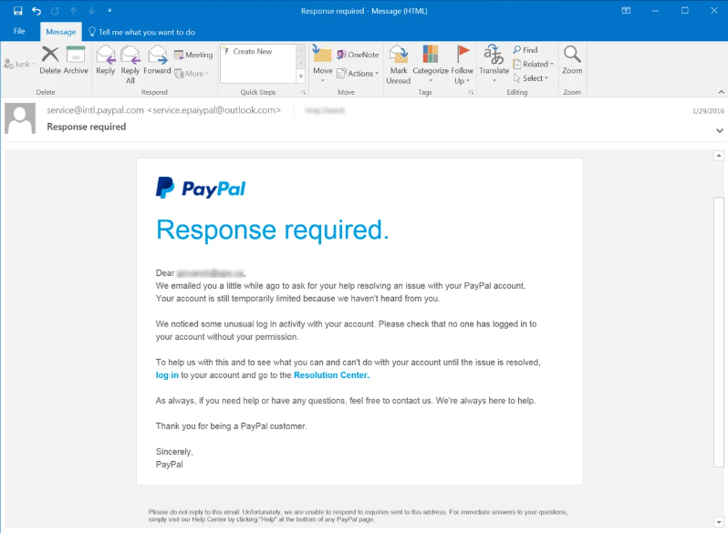

# 📧 Phishing Email Analysis Report

## 🖼️ Screenshot of Email

---

## 🔍 Email Overview

- **From:** `service.epaypal@outlook.com` (appears as `service@intl.paypal.com`)
- **Subject:** "Response required"
- **Date:** January 29, 2016
- **Pretending to be:** PayPal
- **Goal:** Trick the user into clicking a fake link and entering their PayPal credentials

---

## 🛠️ Analysis of Phishing Indicators

### 1. 🚩 **Suspicious Sender Email**
The sender's name is shown as `service@intl.paypal.com`, which seems legitimate at first glance, but the actual address is `service.epaypal@outlook.com`. This is a clear indicator of spoofing.

Legitimate PayPal emails would never come from an Outlook domain.

---

### 2. 🌐 **Misleading Links**
The email urges the user to “log in” via a link that likely does **not** lead to the real PayPal website. In phishing emails, these links typically lead to fake login pages designed to steal your credentials.

Always **hover over the link** (without clicking) to check where it actually leads.

---

### 3. 🔐 **Urgent Language**
The subject line says **"Response required"**, and the message claims the account is limited and needs immediate action. This is a classic scare tactic used in phishing to trigger panic and impulsive clicking.

---

### 4. 👤 **Generic Greeting**
The email says **"Dear Customer"** instead of using the recipient's name. PayPal usually addresses users by their full name. Generic greetings are often a red flag.

---

### 5. 🧠 **Social Engineering Techniques**
The email uses psychological pressure by implying the user’s account is in danger. It creates fear and urgency to push the user to act without thinking. It even includes real-sounding support language like “We’re always here to help” to sound trustworthy.

---

## ✅ Summary of Red Flags

| Red Flag                            | Description                                            |
|------------------------------------|--------------------------------------------------------|
| 🚨 Urgency                         | “Response required”, limited account access            |
| 📧 Spoofed Email Address           | service.epaypal@outlook.com pretending to be PayPal    |
| 🔗 Suspicious Links                | Fake login link likely used for credential theft       |
| 👤 Generic Greeting                | “Dear Customer” instead of user’s actual name          |
| 🧠 Social Engineering              | Fear tactics, fake professionalism                     |

---

## 📌 Final Thoughts

This email is a **classic phishing attempt** that pretends to be from a trusted source (PayPal) to trick the user into giving away login details. It checks many boxes:
- Spoofed sender
- Scary, urgent language
- Fake links
- Psychological manipulation

This task helped me learn how phishing emails operate and what signs to look for — both technically (like email headers and links) and psychologically (like fear-based wording and fake trust cues).

---

🛑 **Tip:** Always double-check the sender’s address and hover over links before clicking. If unsure, go to the official site directly by typing the URL in your browser.
